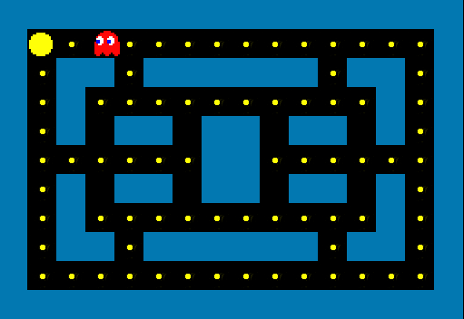
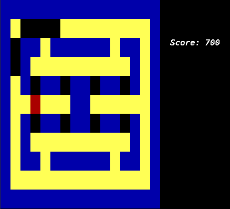

# Arcade

## Project Description
Epitech 2nd year project where you have to create virtual arcade station in **C++** with the possibility to dynamicaly load **at runtime** **games** and change the **graphical library**.

**Games** and **graphical libraries** are **shared libraries**.

## Screenshots

## Current Libraries
The currently implemented games are:
- Snake
- Pacman  

The currently implemented graphical libraries are:
- NCurses
- SFML
- SDL2

## Compilation
To be able to compile this project, you will need to have SFML, SDL2 and ncurses installed.

To compile the project, just use the `make` command.
To uninstall, use `make fclean`.

## Use the arcade
To start the arcade program, you have to start it by using the command: `./arcade [graphical_library]`.
*graphical_library* is the path to the shared object.

In the menu you can change the game using the *o* and *l* keys, you can also change the grahical library using the *p* and *;* keys.

The ingame movements are made with the arrows keys.
